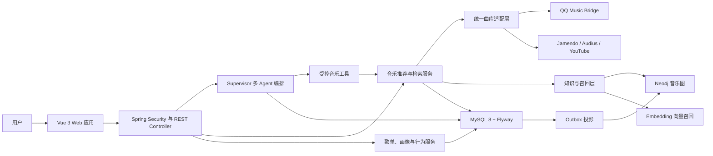

# Sonora Music Space

Sonora Music Space 是一个面向个人使用场景的智能音乐空间。它把自然语言音乐助手、多曲库检索、
个性化推荐、资料浏览、歌单管理和连续播放整合在同一个应用中，让用户可以从一句自然语言需求出发，
完成“理解意图 → 找到真实内容 → 开始播放 → 保存歌单 → 反馈偏好”的完整闭环。

项目采用 Vue 与 Spring Boot 前后端分离架构，以 MySQL 作为唯一事实源，使用 Neo4j 与向量召回增强
个性化能力，并通过意图、画像、执行、回复和会话 Agent 的角色协作，将模型推理限制在明确、可测试的边界内。QQ 音乐、
Jamendo、Audius 和 YouTube 被统一到同一套曲目模型与降级策略中，任一来源不可用时不会拖垮整个体验。

## 项目解决的问题

| 常见痛点 | Sonora 的解决方式 |
| --- | --- |
| 音乐搜索依赖精确关键词，自然语言需求难以落地 | 将用户表达解析为歌曲、歌手、专辑、风格、情绪、场景和排除项，再编译为结构化检索计划 |
| AI 容易生成“听起来合理”但不存在的歌曲 | 模型只负责理解和规划，最终结果必须来自真实曲库并通过字段、可播放性和版本词校验 |
| 单一曲库受地区、账号、版权和接口波动影响 | 并行聚合多曲库，设置独立超时、错误隔离、去重和来源级降级 |
| 推荐结果缺乏个人差异，也无法解释为什么推荐 | 融合显式偏好、行为信号、会话场景、图关系、向量相似度和新鲜度，并返回推荐原因 |
| 播放、跳过等前端事件容易重复或被伪造 | 行为必须引用服务端生成的真实曝光，使用 UUID 幂等，并由服务端反查位置、特征和策略版本 |
| 音乐助手、歌单页和播放器彼此割裂 | Agent 结果可直接入队、播放或保存，音乐库和底部播放器共享统一播放上下文 |
| 第三方登录 Cookie 容易泄漏到浏览器、日志或仓库 | 使用独立 Edge 登录上下文采集必要会话字段，Spring Boot 通过 AES-GCM 在本机加密保存 |
| 本地项目配置复杂，敏感配置容易误提交 | 提供脱敏模板、Flyway 数据源库和统一启动脚本；密钥、Cookie、日志、备份和运行目录默认忽略 |

## 整体架构



系统分为六个主要层次：

1. **交互层**：Vue 页面、聊天消息、音乐资料页、设置弹窗和跨页面播放器。
2. **协议与安全层**：REST Controller、DTO/VO、参数校验、CSRF、Session、Remember-Me 和资源归属校验。
3. **业务层**：对话、检索、推荐、播放、歌单、画像、反馈和 QQ 音乐接入服务。
4. **Agent 层**：LangChain4j Agent、动态 Skill 注册表、工具白名单和结构化音乐执行计划。
5. **数据与召回层**：MySQL 事实数据、Neo4j 图关系、Embedding 向量以及可靠 Outbox 投影。
6. **外部适配层**：QQ Music Bridge、Jamendo、Audius、YouTube、MusicBrainz、Wikidata 和模型 API。

更详细的组件边界、数据流和扩展约束见 [架构文档](docs/ARCHITECTURE.md)。

## 核心功能

### 1. 账号与会话安全

- 用户名、邮箱或手机号登录，支持验证码、邮箱验证和注册校验。
- Spring Security Session、CSRF 防护和资源级用户归属验证。
- “记住我”使用服务端签名 Cookie 保持登录状态。
- 浏览器支持 Credential Management API 时，可由浏览器密码管理器保存账号和密码；项目不把明文密码写入 LocalStorage。
- 对话、歌单、画像、曝光与 QQ 登录任务全部按当前登录用户隔离。

### 2. 智能音乐 Agent

- 支持用自然语言描述歌曲、歌手、专辑、风格、心情、场景和相似音乐需求。
- `MusicAgentCoordinator` 采用 `Intent → Supervisor → Handler Registry → 子 Agent → Evaluator → Response` 的有界工作流；规划、运行时协作和工具命令分别由自动注册的 Strategy/Command 承担，启动时会校验路由无遗漏、无重复，每轮任务都有依赖、负责人、状态和最大尝试次数。
- 对“我不开心、压力很大、睡不着”等没有显式音乐命令的表达，Context Agent 会生成临时支持合同；Supervisor 只从当前已加载且主动声明支持场景的 Skill 中选择只读能力，搜索真实歌曲或歌单，并返回音乐卡片与可执行快捷建议。
- 主动关怀采用分级自主性：搜索和展示结果可以自动执行，播放、入队和画像写入仍需明确请求；本次情绪不会写入长期画像。明确自伤或立即危险信号优先进入安全支持流程，不把音乐当作唯一解决方案。
- 语义 Intent Agent 将自然表达解析为 `动作 + 对象 + 模式 + 排序依据 + 时间窗口 + 场景 + 个性化` 合同；Java 校验层强制服从用户明说的“歌曲/歌单/歌手”等对象和产品领域，模型不可直接决定工具调用。
- Planner 将已确认意图拆成可见 Todo；前端提交后立即显示占位进度，服务端返回真实任务快照并随会话持久化，刷新后仍可恢复。
- Evaluator 只接受有结构化事实的执行结果。推荐、艺人、歌单等安全读取任务遇到网络、超时或暂时不可用时最多重试一次；播放和队列写操作不自动重试，避免重复副作用。
- 运行时加载的 Skill 与 `AgentCapabilityContributor` 是能力事实源；新增能力模块会自动进入能力说明和请求匹配，不需要修改中央 Java 清单或固定回答文案。
- `AgentCapabilityGateway` 依据实时能力快照处理能力询问、受限寒暄、越界和待澄清请求；未识别动作不会进入不受约束的通用知识问答。
- 意图 Agent 采用“零温度语义草案 + 确定性规则合并 + 上下文纠正”的混合路由；模型不可用时完全回退本地规则，画像不得覆盖歌曲、歌手、页码或播放动作。
- 对“最近最火”“本周热度榜”等趋势请求使用独立 `QQ_TREND_DISCOVERY` 路由，读取带来源、周期和排名依据的 QQ 官方榜单；绝不把排名语义降级成普通关键词搜索。
- Evaluator 同时验收执行成功、目标类型和 Action 证据：用户要歌单却只返回歌曲卡片、或声称排行却没有排行证据时，本轮结果会被拒绝。
- 画像 Agent 只读取带证据 ID、置信度和统计值的只读快照，负责自然、灵活地解释画像；模型不可用时返回可审计模板。
- 开放推荐显式执行 `Intent → Profile Context → Execution → Response`：画像快照写入本轮状态，通过软偏好合同参与召回和排序，不再改写原始请求。
- 执行 Agent 是唯一拥有音乐工具权限的角色，检索结果必须来自真实曲库，播放和队列动作只能基于已验证结果。
- 回复 Agent 只能转述执行事实，不能增删歌曲、伪造成功状态或二次调用工具；普通会话由无工具的会话 Agent 处理。
- `AgentToolAuthorizer` 保证只有 Execution Agent 能调用已被真实 Skill 绑定的工具；`AgentResponseGuard` 要求播放、搜索和入队声明必须有对应结构化 Action 证据。
- 推荐查询继续使用零温度结构化规划器，并复用同一份已验证计划；模型不可用时自动切换本地规则规划器。
- “换一批”是独立的批次刷新语义，不等同于“不喜欢”：它不写负反馈，也不修改长期偏好，只要求本轮优先返回未展示内容。
- 对话历史持久化到 MySQL，并按 `userId + conversationId` 恢复独立记忆。
- Agent 返回的音乐动作可以在刷新会话后恢复，继续执行播放、入队、打开歌手或保存歌单。

当前内置 Skill 包括：

- 音乐发现与结构化搜索
- 播放和播放队列控制
- 音乐画像解读
- QQ 音乐歌手资料发现
- QQ 音乐公开歌单发现
- QQ 音乐官方榜单、热门歌手与指定歌手热门歌曲趋势
- 最近推荐追问、批次反馈与明确偏好修正
- 情绪情境理解、运行时 Skill 主动建议与安全关怀

### 3. 多曲库检索

- QQ 音乐：中文主流歌曲、歌手、专辑、歌单、歌词、视频和播放地址。
- QQ 音乐榜单：巅峰榜、地区榜、特色榜、全球榜等实时目录及官方名次；Sonora 在本地保存周期快照，提供近期热门歌手和指定歌手上榜歌曲聚合。
- Jamendo：可直接播放的开放音乐内容。
- Audius：独立音乐与直接音频补充。
- YouTube：在直接音频不足时使用官方可见 IFrame 补位。
- MusicBrainz 与 Wikidata：补充标准化音乐实体与公共知识。
- 每个来源拥有独立超时和错误隔离，结果统一标准化后再排序与去重。
- 支持精确歌曲、歌手、专辑、场景、相似音乐和模糊实体等不同检索路线。

### 4. 个性化推荐闭环

推荐不是单次关键词搜索，而是一条可降级、可解释的排序流水线：

1. 将自然语言转换为结构化 `MusicSearchPlan`。
2. 读取显式偏好、行为推断、当前会话场景和近期负反馈。
3. 并行召回在线曲库、Neo4j 标签图和 512 维 Embedding 相似结果。
4. 通过 weighted RRF 融合不同召回通道。
5. 使用语义匹配、结构化匹配、来源质量和可播放性完成内容粗排。
6. 通过 Thompson Sampling 保留探索位，通过 MMR 控制艺人和标签重复。
7. 批次刷新时，基于请求指纹硬排除当前会话最近 6 批结果，并同时识别跨曲库的“同歌名 + 主艺人”重复；召回页会逐批后移，图召回和向量召回也必须经过同一新鲜度过滤。
8. 新歌曲不足时如实返回较少结果，不用旧结果悄悄补满；精确点歌不受批次过滤影响。
9. 返回推荐原因、探索标识、策略版本和服务端曝光 ID。
10. 播放、跳过、播完、喜欢、收藏和不相关反馈继续更新用户画像。

画像会额外聚合每首歌曲的有效播放、完播、跳过、循环和实际收听时长，并给出最常听歌曲、歌手与标签。
QQ 专辑提供的曲风和语种以高可信标签保存，QQ 公开歌单标签作为较弱的场景证据保存；所有标签均记录来源和
置信度，不把歌单标签伪装成单曲官方标签。累计达到 20 次有效播放且覆盖至少 8 首不同歌曲后，系统才会
生成带证据说明的用户标签，例如“华语流行偏爱者”“某歌手深度听众”或“单曲循环型听众”。

偏好数据分层管理：

- **L0 原始行为**：保留可审计的播放与反馈事件。
- **L1 显式偏好**：用户主动编辑，长期有效。
- **L2 行为推断**：满足最小证据量和置信度后生成，默认 30 天过期。
- **L3 会话场景**：只影响当前会话，默认 24 小时有效。

MySQL 是唯一事实源。行为通过 Outbox 可靠投影到 Neo4j；图数据库、向量服务或模型不可用时，系统自动
回退到在线曲库与本地规则排序，搜索和播放不会因此中断。

### 5. 音乐空间与播放体验

- 独立音乐首页、场景推荐、公开歌单、搜索结果和个性化状态。
- 音乐首页内置官方榜单分区、榜单歌曲播放、近期热门歌手及 DAY/WEEK/MONTH/已积累窗口切换；界面始终展示实际数据覆盖日期。
- 歌曲、歌手、专辑、视频、歌单和歌词详情页。
- 同步歌词、翻译、罗马音以及可点击跳转播放进度。
- 跨页面底部播放器、播放队列、上一首、下一首、循环、随机和进度控制。
- 按登录用户保存当前曲目、队列和有效播放断点，刷新、关闭浏览器或重新进入后可从上次中断位置继续。
- 断点续播沿用同一个播放会话 UUID，刷新不会重复增加播放次数；拖动进度条跳过的区间不计入实际收听时长。
- 搜索结果、Agent 消息和歌单详情共享同一个播放状态。
- 播放地址按需解析，不在数据库中长期保存易过期 URL。
- QQ 音频按无损、320K、128K、M4A 逐级降级；无权益内容不会阻塞其他来源。

### 6. 歌单与音乐资产

- 创建、重命名和删除自建歌单。
- 将一次真实推荐整体保存为歌单。
- 按场景生成推荐并直接保存。
- 管理“我喜欢的音乐”和“最近播放”。
- 增删歌单曲目，保留曲源标识和元数据快照。
- 每次打开歌单都会生成新的可信曝光，使旧歌单行为仍能安全参与画像学习。
- 支持逻辑删除，避免用户误操作导致数据立即丢失。

### 7. QQ 音乐本机接入

QQ Music Bridge 只监听 `127.0.0.1`，不开放 CORS，也不向局域网暴露服务。

1. 用户在 Sonora 设置中点击“打开 QQ 登录窗口”。
2. Bridge 使用独立 Microsoft Edge 配置打开 QQ 官方登录页面。
3. 用户扫码或完成官方网页登录。
4. Bridge 只读取 QQ 域下必要的音乐会话字段。
5. Cookie 仅通过回环连接传给 Spring Boot，并立即使用 AES-GCM 加密保存。
6. 登录成功、取消或超时后，独立 Edge 窗口自动关闭。

QQ Cookie 不返回前端、不打印到日志、不写入普通配置文件，也不会被 Git 提交。专用 Edge 配置、密钥、
加密会话和运行日志统一位于已忽略的 `runtime-data/`。

### 8. 数据库源库

- `src/main/resources/db/migration` 是应用运行时使用的 Flyway 迁移源。
- `database/mysql/migrations` 是便于独立审阅和部署的 MySQL 数据源包。
- 数据源库只包含表结构、约束、索引、注释和非个人迁移数据。
- 开发数据库备份、用户记录、会话、验证码、Cookie 和收听历史不会进入仓库。

## 技术栈

| 领域 | 技术 |
| --- | --- |
| 前端 | Vue 3.5、Vue Router 5、Pinia 4、Vite 8、Lucide Vue |
| 后端 | Java 17、Spring Boot 3.5、Spring Web、Spring Validation |
| 认证安全 | Spring Security、CSRF、HTTP Session、Remember-Me、浏览器 Credential Management API |
| Agent | LangChain4j 1.18、OpenAI-compatible 模型接口、动态 Skill、结构化 Tool Calling |
| 关系数据库 | MySQL 8、Spring Data JPA、Hibernate、Flyway |
| 图与向量 | Neo4j 5.26、Neo4j Java Driver、Embedding 向量召回 |
| 音乐来源 | QQ 音乐、Jamendo、Audius、YouTube、MusicBrainz、Wikidata |
| 本机 Bridge | Node.js 20、Playwright Core、Microsoft Edge、Node HTTP Server |
| 测试 | JUnit 5、Spring Boot Test、Spring Security Test、Mockito、Node Test Runner |
| 工程化 | Maven Wrapper、npm lockfile、PowerShell 一键启动、Git 脱敏规则 |

## 代码结构

```text
.
├── frontend/                         Vue 前端
│   └── src/
│       ├── views/                    页面级用例
│       ├── components/               UI 与音乐交互组件
│       ├── services/                 API、凭证与浏览器适配
│       ├── stores/                   全局认证和播放状态
│       └── router/                   路由与登录守卫
├── src/main/java/com/example/agent/  Spring Boot 后端
│   ├── controller/                   REST 协议层
│   ├── service/                      业务接口
│   ├── service/impl/                 业务实现与外部适配
│   ├── agent/                        能力边界、角色 Agent、合同与回复守卫
│   ├── orchestration/                多 Agent 工作流编排
│   ├── skill/                        Agent Skill 注册与校验
│   ├── tools/                        Agent 原子工具
│   ├── model/                        DTO、AO、BO、VO 与 Entity
│   ├── repository/                   JPA 数据访问
│   └── security/                     登录主体与认证
├── src/main/resources/
│   ├── agent-skills/                 Skill 与工具绑定
│   └── db/migration/                 Flyway 迁移
├── integrations/qq-music-bridge/     QQ 音乐本机 Bridge
├── database/mysql/migrations/        可独立使用的数据库源库
├── scripts/                          本地运行支持脚本
└── docs/                             架构和工程文档
```

## 快速启动

### 环境要求

- Windows PowerShell 7+
- Java 17
- Node.js 20+
- MySQL 8
- Microsoft Edge（启用 QQ 音乐登录时需要）
- Neo4j 5.26（个性化图召回，可按配置关闭）

### 1. 创建本机配置

```powershell
Copy-Item .env.example .env
Copy-Item src/main/resources/application.example.yml src/main/resources/application.yml
```

填写本机 MySQL、SMTP、模型和可选音乐数据源凭据。`.env` 与 `application.yml` 已被 Git 忽略。

### 2. 初始化依赖

```powershell
.\mvnw.cmd test
Set-Location frontend
npm install
Set-Location ..\integrations\qq-music-bridge
npm install
Set-Location ..\..
```

MySQL 表结构由 Flyway 在后端启动时自动升级，也可以按版本顺序独立执行 `database/mysql/migrations`。

### 3. 启动开发环境

```powershell
.\run-dev.ps1
```

启动脚本会检查 MySQL，并按需启动 Neo4j、QQ Music Bridge、Spring Boot 和 Vue：

- Web：`http://127.0.0.1:5173`
- API：`http://127.0.0.1:8080`
- QQ Music Bridge：`http://127.0.0.1:3200`
- Neo4j Browser：`http://127.0.0.1:7474`

## 配置原则

- 所有真实密钥只写入本机 `.env` 或用户环境变量。
- 仓库只提交 `.env.example` 与 `application.example.yml`。
- `runtime-data/` 保存本机加密会话、Neo4j 数据和临时浏览器配置，不进入 Git。
- `database/backups/` 仅用于本地备份，不进入 Git。
- 前端不接收曲库 API Key、QQ Cookie、SMTP 密码或模型密钥。

主要配置项见 [.env.example](.env.example)。

## 测试与质量保障

```powershell
# 后端单元测试、架构测试和集成测试
.\mvnw.cmd test

# 前端服务测试与生产构建
Set-Location frontend
npm test
npm run build

# QQ Bridge 语法与登录会话测试
Set-Location ..\integrations\qq-music-bridge
npm run check
npm test
```

测试覆盖认证、用户隔离、对话恢复、检索计划、候选校验、个性化排序、歌单、Skill 注册、QQ 登录会话、
浏览器密码管理适配和播放行为去重。真实模型 smoke test 需要显式配置 API Key 才会运行。

## 安全与边界

- 本项目不缓存或分发第三方完整音频文件。
- QQ 音乐接口和播放权益可能发生变化，失败时系统会自动回退到其他已配置曲库。
- YouTube 内容通过官方可见 IFrame 播放。
- 音乐内容、封面、歌词和元数据的权利归各自提供方及权利人所有。
- 本机 Bridge 仅用于当前设备的个人登录状态，不应暴露到公网。
- 第三方开源代码与许可证信息见 [Third-party notices](THIRD_PARTY_NOTICES.md)。

## 项目定位

Sonora 的重点不是再做一个音乐列表页面，而是建立一个可信的智能音乐工作流：模型负责理解，工具负责
执行，曲库负责提供真实内容，服务端负责权限与证据，推荐系统负责持续学习，播放器负责把结果落到真实
体验。每一层都可以独立测试、替换和降级，因此应用既具备 Agent 的自然交互能力，也保留传统业务系统
在数据一致性、安全性和可维护性上的工程边界。
