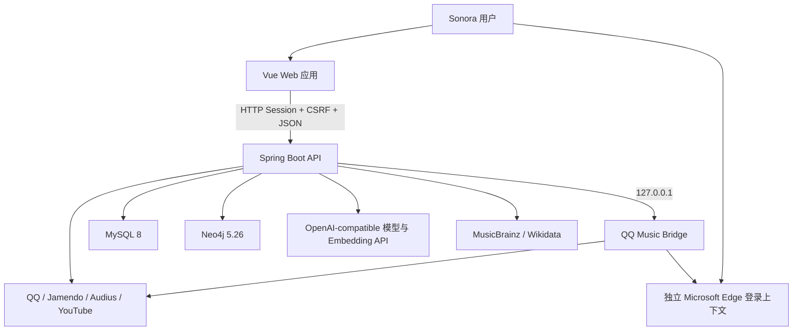
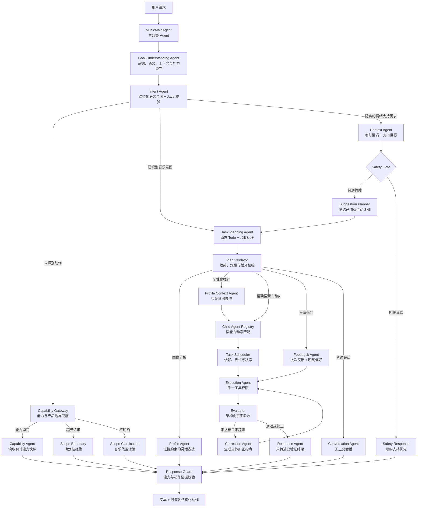
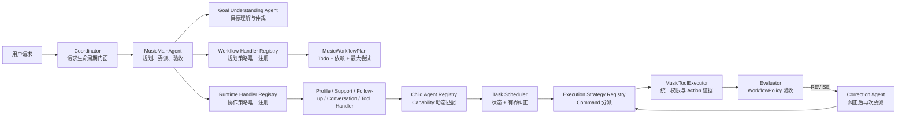
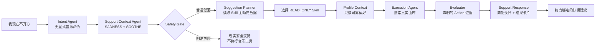
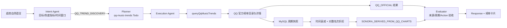
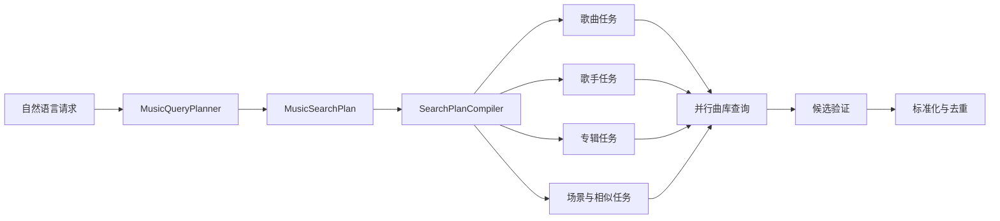
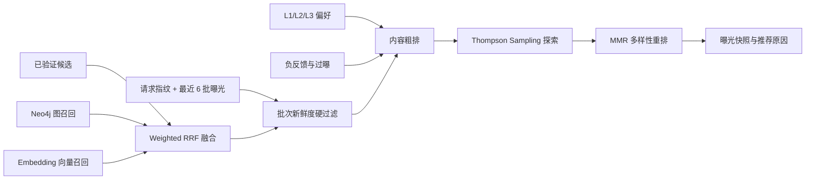
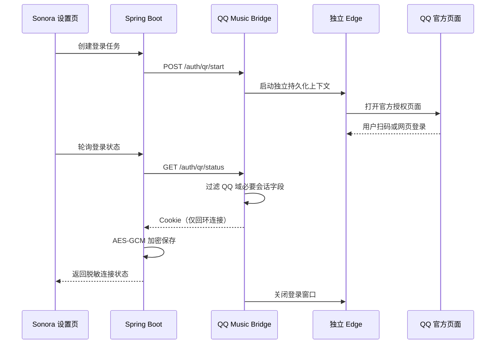

# Sonora Music Space 架构说明

本文档描述 Sonora Music Space 当前代码的系统边界、运行组件、核心数据流和长期开发约束。README 面向
项目使用者，本文件面向需要理解、维护或扩展代码的开发者。

## 1. 架构目标

Sonora 的架构围绕以下目标设计：

- **真实可执行**：模型只理解意图和选择工具，音乐结果必须来自真实曲库。
- **稳定降级**：模型、单个曲库、图数据库或向量能力故障时，基础搜索与播放仍可工作。
- **数据可信**：画像学习只接收与服务端曝光关联的幂等行为事件。
- **用户隔离**：对话、记忆、歌单、画像和登录任务必须绑定当前登录用户。
- **本机隐私**：API Key、QQ Cookie、邮件授权码和浏览器配置不能进入前端、日志或 Git。
- **可替换**：模型、曲库、召回器、排序策略和 Agent Skill 通过接口与资源定义解耦。
- **可测试**：业务流程使用强类型对象与普通 Java 编排，核心决策不依赖无法断言的自由文本。
- **能力可插拔但不可虚构**：运行时 Skill 与能力贡献者自动形成能力快照；只有绑定真实工具或受验证模块的能力才会被授权和对外说明。

## 2. 系统上下文



运行时包含三个应用进程：

| 组件 | 默认地址 | 职责 |
| --- | --- | --- |
| Vue/Vite | `127.0.0.1:5173` | 页面、路由、交互状态和播放器 |
| Spring Boot | `127.0.0.1:8080` | 认证、业务、Agent、推荐、持久化和安全边界 |
| QQ Music Bridge | `127.0.0.1:3200` | QQ 网页会话、QQ 元数据请求和播放地址解析 |

MySQL 是业务数据的唯一事实源。Neo4j 和 Embedding 结果属于可重建的召回加速层，不能成为用户偏好、
行为或歌单的唯一保存位置。

## 3. 前后端边界

### 3.1 前端

```text
frontend/src
├── views          页面级用例和路由落点
├── components     可复用 UI、结果卡片、设置和播放器
├── services       API、CSRF、浏览器凭证和纯逻辑适配
├── stores         Pinia 认证、曲库和播放状态
├── router         路由、懒加载和登录守卫
└── assets         全局设计令牌、布局和响应式样式
```

前端职责：

- 管理页面导航、交互反馈、播放队列和浏览器媒体对象。
- 通过统一 API Service 获取 CSRF Token 并携带 Session Cookie。
- 将 Agent 消息中的结构化动作恢复为可点击的音乐操作。
- 对播放、切歌、跳过和播完做客户端去重，再提交服务端行为事件。
- 在浏览器支持时调用 Credential Management API，由浏览器密码管理器接管密码保存。

前端禁止：

- 拼接或持久化曲库 API Key、QQ Cookie、SMTP 密码和模型凭据。
- 仅依赖路由守卫实现权限控制。
- 自行声明曝光位置、策略版本或歌曲特征作为可信行为证据。
- 长期保存 QQ 播放 URL 等易过期地址。

### 3.2 后端

```text
com.example.agent
├── config                Spring Bean、Security 与配置属性
├── controller            HTTP 协议适配、验证和 DTO/VO 转换
├── exception             统一业务异常
├── model
│   ├── dto               外部请求模型
│   ├── ao                Controller 到 Service 的应用对象
│   ├── bo                Service 输出的业务对象
│   ├── vo                面向前端的响应对象
│   └── entity            JPA 持久化实体
├── repository            Spring Data JPA 数据访问
├── security              登录主体、认证查询和密码编码
├── service               业务接口与 Agent 能力接口
│   └── impl              事务、规则、排序和外部适配实现
├── agent                 能力边界、角色 Agent、合同与回复守卫
├── orchestration         多 Agent 串行工作流协调器
├── skill                 Skill 资源解析、绑定与完整性校验
├── tools                 LangChain4j 可调用的原子音乐工具
└── utils                 无状态通用逻辑
```

依赖方向：

```text
Controller -> Service interface -> AO / BO
Controller -> DTO / VO
Service implementation -> Repository -> Entity
Service implementation -> Catalog / Knowledge / Model / Bridge adapter
Capability Gateway -> Coordinator -> Runtime Handler Registry -> Role Agent
Planner -> Workflow Handler Registry -> MusicWorkflowPlan
Execution Agent -> Execution Strategy Registry -> Authorized Tool -> Service interface
```

分层约束：

- Controller 不直接访问 Repository、模型、SMTP 或曲库。
- 外部请求必须使用明确 DTO，不使用 `Map` 代替协议模型。
- Service 接口不能依赖 Controller、DTO、VO、Repository 或 Entity。
- Repository 只读写 Entity，不承担业务决策。
- Entity 通过受控工厂或构建器维护不变量，不向业务层暴露通用 Setter。
- 外部平台字段在适配器内转换为统一 BO，不能泄漏到通用推荐模型。
- 权限检查以 Spring Security 主体和服务端资源归属为准。

## 4. Agent 与 Skill 架构

Agent 不是直接访问数据库或外部平台的万能入口。`MusicMainAgent` 是当前唯一的主监督 Agent，负责理解、拆解、
规划、委派和验收；它自身没有业务工具权限。主链采用角色分离的串行协作：需要自然语言弹性的画像解释和
普通对话由专门语言 Agent 负责，需要严格执行的搜索、推荐、播放和队列操作交给确定性执行 Agent。所有角色通过
不可变合同交换数据，不共享内部对话记忆，也不能互相直接调用。



### 4.1 能力边界

`AgentCapabilityRegistry` 在启动时从已加载的 `AgentSkillRegistry` 和可选 `AgentCapabilityContributor` 聚合实时能力
快照。Skill 的名称、说明、真实工具绑定和触发词共同构成自描述信息，不存在需要同步维护的中央 Java 能力清单。
`MusicIntentAgent` 首先把原始请求解析为 `MusicIntentDraft`：动作、目标对象、发现模式、排序指标、时间窗口、场景、
个性化标记、缺失槽位、置信度和领域。LLM 只提交零温度结构化草案，Java 合并器会强制覆盖用户明说的对象、命令和
领域边界；非法或低置信度输出回退本地规则。`MusicIntentContextStore` 只保存会话内最近意图，使“我是说歌单推荐”
这类纠正可以继承上一轮的“深夜”等场景，但不会把不同会话串在一起。

只有语义层没有识别出音乐动作时，`AgentCapabilityGateway` 才根据实时快照完成能力询问、受限寒暄、越界和待澄清
分类。Skill 触发词仍用于描述和发现能力，却不再充当自然语言理解的硬门禁。“你有哪些能力”由
`AgentCapabilityAgent` 直接读取当前快照回答；新模块注册后会自动出现在回答中。趋势排行属于能力敏感意图：系统
将它路由到 `QQ_TREND_DISCOVERY`，只有 `queryQqMusicTrends` 产生带榜单来源、统计周期、实际覆盖日期和排名依据的
结构化证据后才能通过验收，不允许把“最近热度最高”原样交给普通曲库搜索。

`AgentToolAuthorizer` 在工具调用前再次校验角色和工具。当前只有 Execution Agent 可以调用已被真实 Skill 绑定的工具，
Intent、Profile、Feedback、Conversation 和 Response Agent 均无法通过 Prompt 获得工具权限。`AgentSkillRegistry`
启动时交叉校验 `@Tool` 与 Skill 绑定：工具必须真实存在且被 Skill 覆盖；能力贡献者若声明工具，也必须引用这组
已经注册的真实工具，否则应用拒绝启动。

最终回复在离开 `AgentChatServiceImpl` 前经过 `AgentResponseGuard`。能力询问始终替换成运行时快照答案；“已经播放”必须有
`PLAY_TRACK` 动作，“已经入队”必须有队列动作，“已经找到”必须有结构化曲库结果；普通对话生成的无证据歌单、
通用 AI 能力声明或执行成功声明会被安全模板替换。能力边界因此不依赖任何单一模型是否遵守提示词。

### 4.2 角色职责

| 角色 | 输入 | 允许能力 | 禁止事项 |
| --- | --- | --- | --- |
| Main Agent | 原始请求、结构化意图、计划、任务结果 | 拆解目标、建立任务图、委派子 Agent、验收结果和控制终态 | 直接调用业务工具、绕过证据把任务标记成功 |
| Goal Understanding Agent | 原始请求、语义提案、确定性证据、会话追问与运行时能力 | 仲裁最终目标、路由、缺失信息、画像需求和支持情境 | 调业务工具、生成曲库结果、绕过能力边界 |
| Intent Agent | 本轮原始请求、会话内最近意图 | 生成结构化意图草案，识别对象、场景、趋势和上下文纠正 | 调工具、改写用户显式对象、跨领域越权、读取画像仓储 |
| Capability Gateway | Intent 未识别的原始请求 | 判断能力询问、寒暄、越界与澄清，不调用模型 | 覆盖已识别音乐意图、执行工具 |
| Capability Agent | 只读能力目录 | 确定性说明真实能力 | 自行增加能力、调用模型或工具 |
| Task Planning Agent | 用户目标、结构化意图、路由、是否使用画像 | 生成强类型 Todo 图、依赖、验收标准和最大尝试次数 | 自由执行任务、修改用户目标 |
| Plan Validator | 候选任务图 | 拒绝重复 ID、未知依赖、循环依赖和超限计划 | 执行任务或放宽安全边界 |
| Correction Agent | 原始任务、验收问题、尝试次数 | 生成下一次委派使用的结构化纠正指令 | 改写用户原始目标、无限重试 |
| Contextual Intent Agent | 原始请求与最近结果摘要 | 拆分批次拒绝、明确偏好和重新推荐 | 执行工具、凭空补偏好 |
| Support Context Agent | 本轮原始表达 | 识别临时情绪信号、支持目标与明确安全风险 | 心理诊断、写长期画像、调用工具 |
| Suggestion Planner | 临时支持合同、运行时 Skill 元数据 | 只选择声明匹配场景、目标、自主级别和输出证据的已加载 Skill | 维护固定能力清单、绕过 Skill、执行工具 |
| Safety Gate | 明确高风险信号 | 阻止把音乐作为唯一响应，优先现实支持 | 诊断、承诺、自动播放 |
| Feedback Agent | 已验证追问计划 | 写入明确偏好和最近推荐批次反馈 | 搜索歌曲、永久拉黑整批歌曲 |
| Profile Agent | 只读 `UserTasteContext` 与问题 | 按证据 ID、统计值和置信度解释音乐画像 | 写画像、搜索/播放、推断年龄性别职业等属性 |
| Profile Context Agent | 本轮用户 ID | 读取推荐所需的只读画像快照并写入工作流状态 | 生成歌曲、改写原始请求、调用播放工具 |
| Execution Agent | 已分类请求 | 调用 `MusicAgentTools`，执行真实检索、推荐、播放和队列操作 | 编造歌曲、在无真实动作时报告成功 |
| Evaluator | `MusicExecutionResult` + `MusicIntentUnderstanding` | 校验成功标记、目标类型、Action 证据与可重试失败类型 | 生成歌曲、调用工具、无限重试 |
| Response Agent | `MusicExecutionResult` | 输出已验证的事实答复 | 调工具、增删歌曲、改变成功状态 |
| Conversation Agent | 当前会话与普通问题 | 无工具自然语言交流 | 声称已搜索、已播放或已修改业务数据 |
| Response Guard | 路由、回复、结构化动作 | 验证能力声明和执行证据 | 调用模型、修改业务数据 |

### 4.3 协作合同与状态

工作流编排不再通过中央 `switch/case` 同时维护规划、执行和重试规则，而是采用三层可插拔策略：



`MusicWorkflowHandler` 负责一个路由族的目标、任务图和 `MusicWorkflowPolicy`；
`MusicWorkflowRuntimeHandler` 负责该路由实际需要哪些子 Agent 协作；`MusicExecutionStrategy` 只负责把允许执行的
路由转换为受控工具命令。三个 Registry 都由 Spring 自动发现实现，并在启动时拒绝路由遗漏、重复所有权或把
非执行路由注册成工具命令。新增能力应增加对应 Handler/Strategy，而不是修改 Coordinator、Planner、Evaluator
中的中央分支。`switch` 只保留在中文数字等封闭的纯值转换中，不承担业务工作流选择。

可执行任务进一步通过 `MusicWorkflowChildAgent` 协议注册。每个子 Agent 声明自身 ID、展示名称、能力集合和优先级；
`MusicWorkflowChildAgentRegistry` 按计划中的 `capabilityId` 选择最高优先级实现，同优先级冲突会在运行前被拒绝。
`MusicWorkflowTaskScheduler` 独占任务尝试次数、动态负责人、验收状态和 `PASS / REVISE / REPLAN / ASK_USER / FAIL`
决策处理；子 Agent 只能返回统一的 `MusicTaskResult` 与 `MusicTaskEvidence`，不能自行把 Todo 标记成功。当前真实曲库、
歌单、歌手、榜单、播放和主动音乐支持执行已经迁入该调度协议；其余只读角色仍由原有 Runtime Handler 串行推进，
后续可按同一协议逐个迁移，不影响对外 API。

当前调度器已经能把 `REPLAN` 和 `ASK_USER` 转换为明确运行状态，避免误报成功；跨 HTTP 请求持久化待补充问题、
用户回答后恢复原任务图，以及保留已完成节点的自动重新规划仍属于下一迁移阶段，不能把状态枚举本身理解为已完成
持久化恢复能力。

`MusicAgentTurn` 保存用户、会话、不可变的原始请求以及仅供下一次子 Agent 执行的 `executionDirective`；
`MusicIntentDraft` 保存结构化语义槽位，`MusicIntentUnderstanding` 保存
经校验的路由、支持状态和面向用户的澄清信息；`MusicAgentWorkflowState` 保存当前意图、路由、推荐画像上下文、执行结果、
最终答复、实际参与角色与 `MusicWorkflowSnapshot`。Supervisor 通过 `MusicWorkflowPlan` 创建本轮运行实例，计划中的
每个 `MusicWorkflowTaskSpec` 都声明任务 ID、标题、能力 ID、负责人、依赖、最大尝试次数和显式验收标准。
`MusicPlanValidator` 在任何子 Agent 执行前拒绝重复任务、未知依赖、循环依赖和超过八项任务的计划。运行态只能沿
`PENDING → RUNNING → VERIFYING → COMPLETED/FAILED` 推进，重试时进入 `RETRYING`，请求用户补充时进入
`WAITING_USER`，重新规划时进入 `REPLANNING`，未执行分支显式标记 `SKIPPED`。

`UserTasteContext` 只暴露音乐行为证据，不暴露实体、Repository 或写接口。`MusicExecutionResult` 是回复边界，并显式
携带本次执行产生的 Action 证据类型；Evaluator 据此阻止“要歌单却返回歌曲卡片”和“无排行证据却声称热门榜”等
目标错配。自然语言润色不能改变工具执行事实。最终快照通过 `SHOW_WORKFLOW_PROGRESS` Action 返回前端并写入会话历史；前端在
请求等待期间先展示本地占位 Todo，收到响应后替换为服务端真实状态。当前接口仍为同步请求，不宣称 SSE 实时推送。

开放推荐的主要参与者为 `intent → supervisor → planner → profile-context → execution → evaluator → response`。
Profile Context Agent 读取一次画像，
Execution Agent 将原始请求、已生成的结构化计划与有界画像提示封装为 `PreparedMusicRecommendationAo`。原始请求
始终是硬约束和曝光审计来源；画像偏好只能生成补充召回任务、软排序信号和推荐理由。精确歌曲、歌手或专辑
请求不会调用 Profile Context Agent，画像也不能覆盖本轮明确实体。

协调器保持串行执行，因为可恢复音乐动作使用请求线程内的 `AgentActionContext`。无论成功或异常，外层
`AgentChatServiceImpl` 都会清理该上下文，避免下一请求继承上次动作。只有普通会话使用按
`userId + conversationId` 隔离的持久化记忆，Intent、Profile、Execution 和 Response Agent 均无共享记忆。

Evaluator 根据路由 Handler 的 `MusicWorkflowPolicy`，只对推荐、歌单搜索、艺人查询和结果翻页等幂等读取任务开放
有限重试。除了网络、超时等临时错误，目标类型错配也会返回 `REVISE`；`MusicTaskCorrectionAgent` 保留原始请求，
把失败原因和新的验收要求写入独立执行指令后重新委派给 Execution Agent。每个任务的总尝试次数由同一 Policy
投影到计划，当前最多两次。播放和队列写操作最大尝试次数为一次，
避免重复播放或重复入队。当前 `maxReplans` 为计划合同中的演进边界，尚未启用整图自动重规划；现阶段只执行任务级
有界重试，因此不存在无限自我反思循环。

### 4.4 主动音乐陪伴协作链



`MusicSupportContext` 只保存当前轮次的 `interactionType、signal、goal、confidence、musicDirection`，不进入长期画像。
确定性安全词规则拥有最高优先级，语言模型只补充自然表达理解且无法降低明确风险信号。`AgentSkillDefinition` 的可选
`AgentSkillSupportAffordance` 声明 `support-contexts、support-goals、autonomy、output-action、weight`；没有主动声明的
Skill 不会被建议规划器选中。新增能力需要提供对应 `MusicSupportCapabilityAdapter`，主协调器无需增加固定回答。

当前只允许 `READ_ONLY` 能力在高置信度普通情绪场景中自主执行。搜索结果必须产生 Skill 声明的结构化 Action 才能通过
验收；播放、队列、画像写入等状态操作不会由支持情境隐式触发。前端在真实卡片后显示
`SHOW_PROACTIVE_SUGGESTIONS`，按钮携带能力 ID 和下一轮用户提示，点击后仍经过完整意图、规划、执行与验收链。

### 4.5 QQ 榜单与趋势协作链



QQ Bridge 的 `/charts` 获取当前官方榜单目录，`/chart` 按 `topId + period` 读取官方名次和可播放歌曲。Spring
侧把目录、周期和条目写入 `qq_chart_catalog`、`qq_chart_snapshot` 与 `qq_chart_entry`。官方榜单始终保留
`QQ_OFFICIAL` 来源；热门歌手和指定歌手热门歌曲使用 `recencyDecay / log2(rank + 1)` 聚合，并明确标记为
`SONORA_DERIVED_FROM_QQ_CHARTS`，该分数不是 QQ 官方热度分。服务只报告数据库中真实存在的覆盖起止日期；新部署
尚未积累完整月度或历史样本时，前端会如实显示较短覆盖范围，而不会把请求窗口冒充实际样本范围。

### 4.6 模型与降级

- 语义意图 Agent 使用独立的 `agent.multi-agent.intent.*` 参数，温度固定为 `0`；它只输出结构化草案，非法、低置信度或不可用时回退确定性解析器。
- 画像语言 Agent 使用独立的 `agent.multi-agent.profile.*` 模型参数，允许适度温度以提升表达自然度，但输入仅限证据快照。
- 检索规划同样使用受限模型配置，温度被限制在 `0.2` 以内，非法输出回退到本地规则计划。
- 工具层生成的结构化计划会直接交给推荐服务复用，开放推荐不再为了画像词重新调用一次规划模型。
- 普通会话使用 `agent.multi-agent.conversation.*`，不挂载任何工具。
- 画像模型失败时返回确定性证据模板；检索模型失败时走本地规划；执行未验证时绝不报告操作成功。
- API Key 和 Base URL 仍由通用 `agent.*` 配置提供，角色配置不复制或输出敏感凭据。

### 4.7 Skill 与工具兼容层

Skill 资源仍位于 `src/main/resources/agent-skills/<skill>/`，用于描述目标级工作流、校验工具覆盖以及兼容旧版
Agent 能力测试。主协作链中只有 Execution Agent 可以调用 `MusicAgentTools`；新增工具必须继续保持单一职责，
绑定到明确 Skill，并通过架构测试验证其他角色没有工具、Repository 或实体依赖。

`AgentSkillRegistry` 会：

1. 解析所有 Skill 元数据。
2. 校验 ID、优先级和工具绑定。
3. 确保绑定的 `@Tool` 真实存在。
4. 确保每个注册工具至少被一个 Skill 覆盖。
5. 将 Skill 自动投影为运行时能力；额外的无工具能力由所在模块实现 `AgentCapabilityContributor` 注册。

因此，增加新能力时应先定义业务 Service、强类型合同和原子 Tool，再扩展执行处理器与目标级 Skill；
不应把 HTTP、数据库、平台字段或未校验的模型文本直接送入执行层。

## 5. 检索与推荐流水线

### 5.1 结构化检索



`MusicSearchPlan` 描述歌曲、歌手、专辑、风格、情绪、场景、相似对象、版本要求和排除项。规划器优先使用
模型的结构化输出，异常时由本地规则规划器提供确定性结果。编译器最多生成受控数量的曲库任务，避免模型
无限扩张查询。

候选验证负责：

- 歌名、艺人、专辑和关键词覆盖率。
- Live、Remix、伴奏、翻唱等版本词一致性。
- 媒体类型和可播放协议检查。
- 同名歌曲和跨来源结果去重。
- 模糊实体的保守处理，避免把不确定对象强行标成歌曲或歌手。

### 5.2 个性化排序



内容基础分由语义、结构化匹配和融合排名组成；个性化只在受控范围内调整基础顺序，避免用户历史完全覆盖
当前明确请求。MMR 限制同一艺人和相似标签连续出现，Thompson Sampling 为新内容保留探索机会。

“换一批”由 Intent Agent 解析为独立的 `refreshBatch`，不会被转换成拒绝整批或负反馈。推荐服务为结构化
请求生成稳定指纹，并读取当前用户、会话最近 6 批曝光：同一曲库按 `provider + trackId` 硬排除，跨曲库
按标准化后的“歌名 + 主艺人”硬排除。刷新次数增加时，在线曲库召回页最多前移到第 4 页；随后 QQ、图和
向量候选仍统一经过新鲜度过滤，防止其他召回通道把旧歌重新引入。精确歌曲请求不启用这项过滤。若可验证
的新歌不足，系统返回较短批次并在原因中说明，不以旧结果补满。

所有返回歌曲在响应前写入曝光快照，记录：

- `searchId` 与曲目位置
- 策略版本和推荐原因
- 服务端计算的歌曲特征
- 用户、会话和来源信息
- 请求指纹、批次序号和刷新来源

行为事件必须引用该曝光。服务端不会信任浏览器提交的位置、标签或策略版本。

## 6. 个性化数据模型

| 层级 | 内容 | 生命周期 | 写入来源 |
| --- | --- | --- | --- |
| L0 | 原始播放、跳过、播完、喜欢、收藏和纠错 | 按保留策略归档 | 可信曝光关联事件 |
| L1 | 用户明确喜欢或不喜欢的艺人、风格等 | 永久，直到用户删除 | 用户主动编辑 |
| L2 | 从多次行为推断的偏好 | 默认 30 天 | 达到证据和置信度阈值的学习任务 |
| L3 | 当前对话的场景与临时排除项 | 默认 24 小时 | 当前会话意图 |

重要规则：

- 无操作曝光不视为负样本。
- 播放不足 2 秒不记为跳过。
- 播放达到曲目时长的 90% 才记为播完。
- 断点续播复用 `playbackSessionId`；同一会话中的开始、播完、跳过和循环事件分别幂等。
- 实际收听时长按会话累计值做差量更新，拖动进度条跨越的区间不计入时长。
- `NOT_RELEVANT` 只影响当前会话场景，不直接转成永久厌恶。
- 客户端事件 ID 使用 UUID，重复提交不会产生重复学习数据。

歌曲标签按照来源分级：QQ 专辑曲风和语种为高可信元数据，QQ 公开歌单标签为中低可信上下文，推荐请求
中的标签只作为弱证据。`music_track_tag` 保存类型、原值、标准化值、来源和置信度；外部补全结果由
`music_track_enrichment` 记录状态与检查时间，避免每次播放重复请求 QQ Bridge。

长期统计写入 `music_user_track_stat`，原始 L0 行为即使按 180 天策略清理，歌曲播放次数、实际收听时长、
完播、跳过和循环累计值仍然保留。画像接口实时聚合歌曲榜、歌手榜、标签偏好和可解释用户标签。用户标签
至少需要 20 次有效播放和 8 首不同歌曲，每个结论必须包含可展示的数量或占比依据。

## 7. 数据存储与一致性

### 7.1 MySQL

MySQL 保存：

- 用户、邮箱验证码和认证信息
- Agent 会话与消息历史
- 推荐曝光与行为事件
- 去重播放会话、用户歌曲长期统计和歌曲标签来源
- 显式偏好、推断偏好和会话场景
- 音乐实体知识缓存
- 歌单、歌单曲目和逻辑删除状态
- 图投影 Outbox 与推荐策略状态

表结构由 Flyway 版本化管理。运行时迁移位于 `src/main/resources/db/migration`，可独立部署的同步副本位于
`database/mysql/migrations`。

### 7.2 Neo4j

Neo4j 保存从 MySQL 投影出的歌曲、艺人、风格、标签和用户行为关系，用于图邻域召回和画像解释。
`MusicGraphProjectionService` 消费 Outbox；写入失败会保留重试证据，不回滚已经成功的核心业务事务。

### 7.3 Embedding

Embedding 用于自然语言、歌曲特征和用户偏好的语义召回。向量服务不可用时返回明确降级状态，推荐流程
继续使用曲库、结构化匹配和图召回。

## 8. 认证与用户隔离

认证链路包括：

- 注册字段校验、验证码和邮箱验证。
- 密码哈希、Spring Security 登录主体和 Session 固定攻击防护。
- CSRF Token 获取与写请求校验。
- 可配置的 Remember-Me 签名密钥和有效期。
- Controller 到 Service 的用户 ID 只从认证主体取得，不接受客户端代传。

对话记忆键为 `userId + conversationId`。即使两个用户提交相同 UUID，数据库查询、内存恢复和资源操作仍
通过用户 ID 隔离。歌单、画像、曝光和 QQ 登录任务使用同样的归属校验。

## 9. QQ Music Bridge

Bridge 是独立 Node.js 进程，用于隔离 QQ 网页协议和 Spring Boot 业务层。



安全边界：

- Bridge 仅绑定 `127.0.0.1`，拒绝非回环请求。
- 不启用 CORS，不提供 Cookie 查询接口给浏览器。
- 使用独立 Edge Profile，不读取日常浏览器 Profile。
- Cookie 值不写日志；Spring Boot 成功接收后销毁一次性登录任务。
- AES 密钥和加密会话位于 `runtime-data/`，不会提交到 Git。
- 播放地址在点击时解析，按质量逐级降级。

## 10. 播放架构

播放层统一处理两类媒体：

- Jamendo、Audius 和 QQ 音频使用浏览器 `Audio`。
- YouTube 使用官方可见 IFrame。

Pinia Store 保存当前曲目、队列、播放模式和切歌上下文。搜索页、Agent 消息、歌手页和歌单页只发出统一
播放命令，不分别维护媒体实例。播放地址失效时，由后端重新解析；数据库只保存稳定的来源 ID 和元数据
快照。

播放队列在当前浏览器会话中按用户隔离，断点在本机 LocalStorage 中按用户保存。音频和 YouTube 共用
同一断点规则：至少播放 5 秒、距离结束超过 10 秒且未达到总时长 95% 才允许恢复，默认 30 天过期。
暂停、进度拖动、页面隐藏和 `pagehide` 会刷新断点；正常播完或主动清空当前播放会删除对应断点。
断点同时保存 `playbackSessionId` 和实际累计收听时长。播放器只累计连续的时间增量，进度跳转会重置采样
基线；暂停或页面隐藏时发送一次可幂等聚合的进度事件。

## 11. 故障隔离与降级

| 故障 | 行为 |
| --- | --- |
| 模型不可用 | 使用本地规则规划器和固定业务流程 |
| 单个开放曲库超时 | 返回其他曲库结果，并标记来源状态 |
| QQ 登录过期或无播放权益 | 跳过不可用 QQ 播放，其他来源继续工作 |
| Neo4j 不可用 | 停止图召回与投影，MySQL 业务继续运行 |
| Embedding 不可用 | 使用结构化匹配、图召回和曲库排序 |
| 外部知识源不可用 | 使用已有缓存或不补充知识，不阻塞搜索 |
| 播放 URL 过期 | 点击时重新解析或切换到下一质量/来源 |

外部适配器必须设置超时，不允许在主请求线程无限等待。并行任务允许部分成功，汇总器不能因为单一来源
异常丢弃已经完成的结果。

## 12. 测试策略

- **架构测试**：验证包依赖和分层边界。
- **单元测试**：规划器、编译器、候选验证、排序、文本规范化和 Skill 注册。
- **安全测试**：认证、CSRF、用户隔离和资源归属。
- **集成测试**：MySQL 迁移、会话恢复、歌单、画像、Outbox 和 Neo4j。
- **前端逻辑测试**：播放事件去重、导航返回、问候、缓存和浏览器密码管理。
- **Bridge 测试**：QQ 域 Cookie 过滤、会话标准化和登录响应解析。
- **Smoke Test**：真实模型调用只在显式提供密钥时启用。

测试验证结构、状态变化和业务目标，不依赖模型逐字输出固定句子。

## 13. 扩展方式

### 新增曲库

1. 实现 `MusicCatalogProvider`。
2. 将平台字段转换为统一曲目模型。
3. 配置超时、错误映射和可播放协议。
4. 增加候选验证与降级测试。
5. 在状态 API 中暴露配置和可用性。

### 新增 Agent 能力

1. 先定义角色输入、强类型输出合同、权限和失败降级，不直接在 Prompt 中拼业务对象。
2. 在 `MusicAgentRoute` 和 `MusicIntentAgent` 增加闭集路由，由 Coordinator 统一调度，角色之间不直接依赖。
3. 只读分析能力通过受限上下文端口取得证据；需要真实操作时在 Service 中实现能力，并仅由 Execution Agent 调用。
4. 如需新工具，在 `MusicAgentTools` 增加单一职责 Tool，再新建 Skill 资源并绑定允许的 Tool。
5. 增加路由、合同、失败降级、单次工具执行、上下文清理和架构边界测试。

### 新增偏好信号

1. 定义幂等事件和服务端证据来源。
2. 保存原始 L0 事件，不直接覆盖画像。
3. 明确进入 L1、L2 或 L3 的条件与生命周期。
4. 为推荐调整设置上限和回滚策略。
5. 确保用户可查看或清除学习结果。

## 14. 不变量

以下规则属于项目级不变量：

- MySQL 始终是事实源。
- 模型输出在进入业务系统前必须完成结构、长度和权限校验。
- 前端不能获得服务端密钥或第三方 Cookie。
- 任何用户资源查询都必须包含用户归属条件。
- 行为学习必须引用可信曝光并保持幂等。
- Agent Tool 必须被 Skill 覆盖并通过启动校验。
- 外部依赖必须有超时、错误隔离和可解释降级路径。
- 本机配置、运行数据、数据库备份和浏览器 Profile 不进入版本库。
