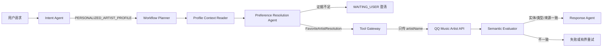
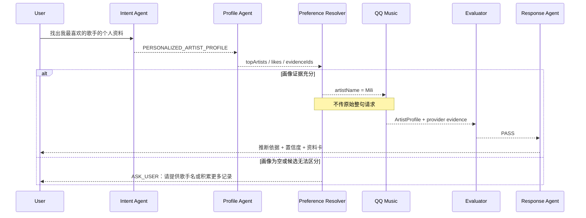

# 个性化实体解析与资料查询架构

## 1. 要解决的问题

请求“把你认为的我最喜欢的歌手的个人资料找出来”不是普通搜索，而是一个有依赖关系的复合目标：

1. 从当前用户的可审计音乐画像中推断候选歌手；
2. 把候选歌手绑定成明确实体；
3. 使用该实体查询 QQ 音乐艺人资料；
4. 验证返回的是艺人档案，并向用户解释推断依据和不确定性。

旧链路只能选择一个单步路由，导致原始自然语言被透传到歌曲搜索。接口虽然返回了数据，但结果没有完成用户目标。

## 2. 设计原则

- **目标与查询分离**：`originalRequest` 只描述用户目标，外部工具只接收解析后的 `resolvedEntity`。
- **先证据、后实体、再工具**：画像不能直接变成搜索字符串，必须经过确定性的实体解析门。
- **不确定时停止**：证据不足或候选接近时进入 `WAITING_USER`，禁止猜测。
- **类型验收之外增加关系验收**：不仅检查返回了艺人卡片，还要检查卡片对应解析出的歌手实体。
- **全过程可审计**：记录画像证据 ID、解析置信度、实际工具参数、结果实体和验收结论。

## 3. 目标架构



### 组件职责

| 组件 | 输入 | 输出 | 禁止事项 |
|---|---|---|---|
| Intent Agent | 原始请求 | 复合路由、目标类型、是否依赖画像 | 调用曲库、猜歌手名 |
| Profile Context Reader | `userId` | 只读 `UserTasteContext` | 使用其他用户数据、生成自然语言查询 |
| Preference Resolution Agent | `UserTasteContext` | `FavoriteArtistResolution` | 无证据猜测、直接调用 QQ 音乐 |
| Tool Gateway | 已解析歌手实体 | QQ 艺人档案卡 | 接收整句复合请求作为关键词 |
| Semantic Evaluator | 目标、解析实体、工具证据 | `PASS/REVISE/ASK_USER/FAIL` | 只依据 HTTP 200 或结果数量判成功 |
| Response Agent | 已验收事实 | 推断依据、置信度、艺人资料 | 添加未验证信息 |

## 4. 运行时序



## 5. 核心数据契约

```text
FavoriteArtistResolution
├── resolved: boolean
├── artistName: string
├── basis: string
├── confidence: 0..1
├── evidenceIds: string[]
└── clarification: string
```

工具调用必须满足：

```text
QQArtistLookupInput.artistName == FavoriteArtistResolution.artistName
QQArtistLookupInput.artistName != originalRequest
```

当前实现优先采用置信度不低于 `0.65` 的显式歌手偏好；否则要求最常听歌手至少有 3 次播放，且播放次数至少为第二名的 `1.25` 倍。阈值应在积累线上数据后配置化，并通过离线评估调整。

## 6. 验收规则

一次成功必须同时满足：

1. 意图路由是 `PERSONALIZED_ARTIST_PROFILE`；
2. 画像证据属于当前用户且包含证据 ID；
3. 解析阶段输出非空歌手实体并达到置信门槛；
4. QQ 音乐工具实际参数是歌手名，而不是原始请求；
5. 结果包含 `SHOW_QQ_ARTIST_RESULTS`；
6. 返回艺人实体与解析实体一致或被可靠别名规则确认；
7. 最终文案只引用已验收事实，并将“推断”与“事实资料”分开表达。

本次代码已经落实 1–5 和证据不足的停止分支；第 6 项应在下一阶段把 QQ 返回的 `artistMid/name` 加入 `MusicExecutionResult` 的结构化证据后完成。

## 7. 可观测性

每次复合任务建议记录以下字段，不记录完整敏感画像：

```text
workflowId, route, userIdHash, profileStage,
candidateCount, resolvedArtistHash, resolutionConfidence,
resolutionEvidenceTypes, toolName, toolQueryType,
queryWasRawRequest, returnedEntityId, evaluationDecision, failureCode
```

关键告警指标：

- `queryWasRawRequest = true`：必须为 0；
- 复合请求被路由到 `MUSIC_DISCOVERY` 的比例；
- `WAITING_USER` 比例及后续补充成功率；
- 解析实体与返回实体不一致率；
- 用户对“这不是我喜欢的歌手”的负反馈率。

## 8. 演进路线

1. **当前切片**：支持“最喜欢的歌手 → 艺人资料”，使用确定性画像证据门。
2. **实体一致性**：将 `artistMid`、规范名称、别名和工具查询参数写入结构化执行证据。
3. **通用化**：把 `FavoriteArtistResolution` 抽象为 `ResolvedMusicEntity<T>`，复用到最喜欢的歌曲、专辑和曲风。
4. **策略配置化**：将最小播放数、领先比例和显式偏好置信度移入配置中心。
5. **离线评估集**：覆盖复合意图、空画像、并列候选、别名、同名歌手、模型误判和工具错误返回。

## 9. 本次落地范围

- 新增复合路由 `PERSONALIZED_ARTIST_PROFILE`；
- 新增可审计的 `FavoriteArtistResolution`；
- 新增确定性 `FavoriteArtistResolver`；
- 新增画像读取、实体解析、艺人查询、验证和回复组成的任务 DAG；
- 外部艺人查询只接收解析后的歌手名；
- 空画像或候选不显著时进入 `WAITING_USER`；
- 增加误路由与证据阈值回归测试。
