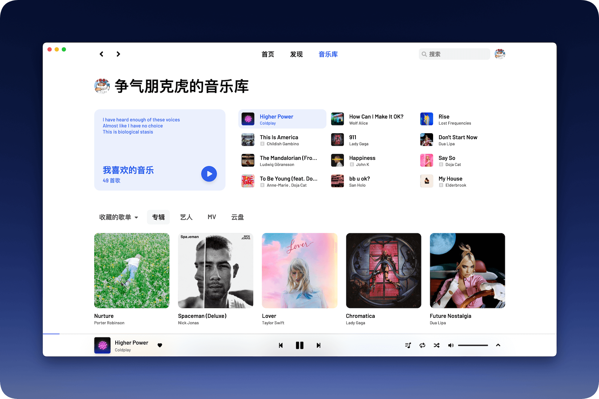
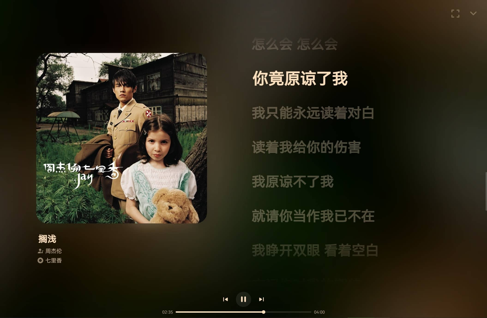
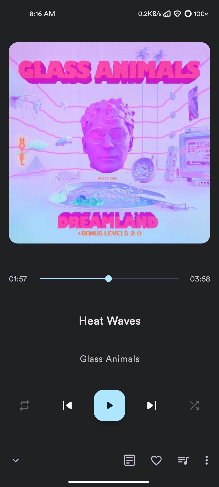
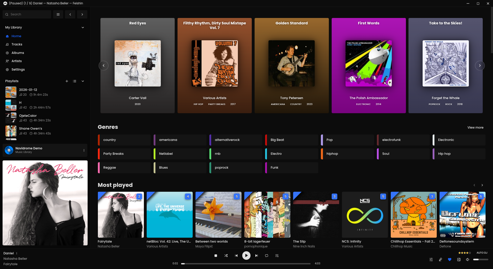
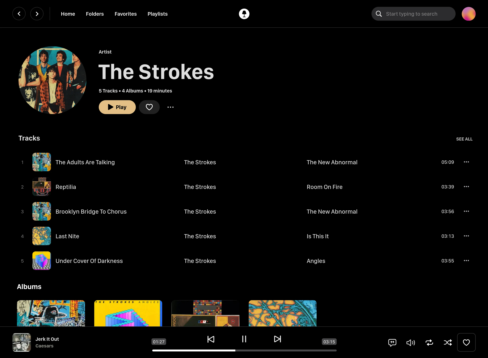

# GitHub 音乐应用：优秀、简约且视觉好看的设计研究

> 研究快照：2026-08-16｜数据源：GitHub 官方仓库、README、仓库内官方截图｜用途：产品设计参考，不代表项目功能或许可背书。

## 一页结论

真正好看的音乐应用通常没有“设计很多东西”，而是让三类内容各自做好一件事：封面负责情绪，文字负责层级，播放器负责连续性。最稳定的结构是“固定导航 + 可滚动内容 + 永久在线播放器”；最有效的视觉手法是“从当前专辑取色，但只把动态色放在播放场景”；最值得克制的是模糊、卡片、描边和常驻按钮。

推荐优先级：

1. **YesPlayMusic**：整体最均衡，留白和信息层级最好。
2. **Cassette**：移动端播放页最克制，封面、元数据和控制层级非常稳定。
3. **SPlayer**：播放页最有氛围，适合中文音乐与歌词体验。
4. **Retro Music Player**：移动端触控与动态色最成熟。
5. **Swing Music**：极简表达最鲜明，适合提炼视觉语言。
6. **Feishin**：桌面媒体库能力最完整，适合重度用户。
7. **WaveFlow**：桌面浏览与沉浸播放切换清晰，适合参考播放场景分层。
8. **Spotube**：跨端结构清晰，但视觉品牌感略弱于前三名。

不建议照抄任何一套完整界面。最佳组合是：YesPlayMusic 的内容页骨架 + SPlayer 的沉浸播放页 + Cassette/Retro 的移动端控制规则 + Feishin 的媒体库效率。

## 评估方法

本轮先从 GitHub 搜索“music player”、Android Material You、自托管播放器等关键词，筛选近期仍有提交且具有一定社区验证的项目；再直接检查仓库内官方界面截图。没有可核验视觉材料的项目，即使活跃，也不进入核心设计推荐。

评分维度与权重：

- 视觉完成度 30%：构图、色彩、排版、素材使用是否统一。
- 简约度 25%：是否能减少视觉噪音，同时保持功能可发现。
- 交互清晰度 20%：导航、主操作、播放状态是否一眼可见。
- 跨页面一致性 15%：列表、详情、播放页是否属于同一系统。
- 可复用性 10%：设计规律是否容易迁移到新产品。

星标只用于证明项目获得过关注，不参与视觉评分；“近期推送”也不等于稳定发行。

## 核心项目评分

| 项目 | 场景 | 视觉 | 简约 | 交互 | 综合 | 最值得借鉴 | 主要风险 |
|---|---|---:|---:|---:|---:|---|---|
| [YesPlayMusic](https://github.com/qier222/YesPlayMusic) | 桌面 / Web | 9.5 | 9.3 | 9.0 | 9.3 | 留白、轻量导航、歌词双栏 | 当前稳定版进入维护，2.0 为 Alpha |
| [Cassette](https://github.com/CassetteLab/cassette) | iOS / macOS | 9.1 | 9.4 | 8.8 | 9.1 | 大封面、低噪声控制区、移动播放层级 | Apple 平台取向明显，桌面布局参考有限 |
| [SPlayer](https://github.com/SPlayer-Dev/SPlayer) | 跨平台 | 9.3 | 8.5 | 8.7 | 8.9 | 专辑取色、沉浸歌词、中文排版 | 原项目维护模式，新功能转向 SPlayer-Next |
| [Retro Music Player](https://github.com/RetroMusicPlayer/RetroMusicPlayer) | Android | 8.8 | 8.8 | 9.1 | 8.9 | Material You、动态色、大触控区 | 首页模块较多时容易拥挤 |
| [Feishin](https://github.com/jeffvli/feishin) | 桌面 / Web | 8.9 | 7.7 | 9.1 | 8.6 | 媒体库效率、信息密度、稳定壳层 | 功能密度高，不是纯极简路线 |
| [WaveFlow](https://github.com/InstaZDLL/WaveFlow) | 桌面 | 8.8 | 8.0 | 8.8 | 8.6 | 浏览/沉浸模式分层、集中式播放控制 | 首页卡片较多，不能整体照搬 |
| [Swing Music](https://github.com/swingmx/swingmusic) | 自托管 Web | 8.7 | 9.2 | 8.3 | 8.7 | 大标题、强主操作、低装饰 | 超大尺度在普通屏幕上浪费空间 |
| [Spotube](https://github.com/KRTirtho/spotube) | 桌面 / 移动 | 8.3 | 8.2 | 8.8 | 8.4 | 跨端导航、统计模块、功能可见性 | 品牌字体与系统 UI 略有割裂 |

星标快照约为：Spotube 48.4k、YesPlayMusic 33.2k、Feishin 9.5k、SPlayer 7.4k、Retro Music Player 5.2k、Swing Music 2.0k。数值来自 2026-08-16 GitHub API 查询，后续会变化。

## 项目拆解

### 1. YesPlayMusic：最均衡的“安静型”界面

它的好看来自秩序而不是装饰。顶部导航只有三个主入口，搜索退到右侧；内容区用大标题建立视觉锚点；专辑卡片几乎不加边框，让封面自己形成网格。底部播放器很薄，但播放、队列、循环、音量仍保持明确分组。

可复用规律：

- 页面只保留一个真正的大标题，其他模块标题明显降级。
- 专辑网格依靠统一封面比例和间距成立，不依靠重阴影或边框。
- 激活色只用于导航、进度和主播放按钮，小面积但高辨识。
- 内容页明亮克制，播放页才使用专辑色和模糊氛围。
- 歌词页采用封面/控制区与歌词区约 45:55 的双栏结构。

不要照抄：顶部导航过于精简时，复杂媒体库会缺少稳定入口；需要在“安静”与“可发现”之间补一层二级导航。

### 2. SPlayer：把专辑封面变成舞台灯光

SPlayer 的沉浸播放页是本轮最有氛围的界面。它没有直接放大封面，而是提取封面主色，生成低频、低对比的全屏背景；封面保持清晰，歌词用亮度而非尺寸变化表示当前行，播放控件退到底部中央。

可复用规律：

- 背景色来自封面，但必须降低饱和度并压暗，避免和歌词争夺注意力。
- 当前歌词用 100% 亮度，临近歌词约 28%–45%，形成纵向节奏。
- 播放状态是全局上下文，不必在沉浸页重复大量元数据。
- 控件围绕“上一首 / 播放 / 下一首”建立中轴，次要操作靠边。

不要照抄：模糊层不能覆盖普通浏览页；若所有页面都使用玻璃和渐变，封面色会从“情绪奖励”变成视觉噪音。

### 3. Retro Music Player：移动端的触控节奏最好

它将 Material You 的动态色用在真正需要强调的地方：主播放按钮、进度和局部图标。封面占据首屏大部分面积，曲名和歌手留出足够呼吸，控制区没有塞入文本标签，适合单手操作。

可复用规律：

- 主要触控目标至少 48dp；核心播放按钮可到 64–72dp。
- 播放页的垂直顺序稳定：封面 → 进度 → 标题 → 主控 → 次控。
- 移动端只保留 4–5 个一级导航项；迷你播放器位于底栏上方。
- 动态色来自封面或系统主题，但文字对比度必须独立校验。

不要照抄：Material You 的大圆角如果应用到每个容器，会迅速产生“满屏胶囊”；建议只用于主操作、推荐入口和弹层。

### 4. Feishin：重度媒体库的桌面效率模板

Feishin 不算最“空”的设计，但它在高信息密度下仍保持清晰。左侧栏兼顾主导航、歌单、服务端和当前专辑；底部播放器跨越全宽；主区使用横向模块和专辑网格。其核心价值是把大量能力压缩到稳定框架，而不是频繁改变页面结构。

可复用规律：

- 桌面端复杂应用需要稳定左栏，宽度约 232–264px。
- 左栏只显示高频入口；低频设置和服务状态放到底部。
- 播放器始终固定在底部，页面内容不得改变其位置或高度。
- 高密度界面优先靠对齐、字号和分组解决，减少卡片套卡片。

不要照抄：类型标签、评分、服务状态、播放队列同时常驻，会提高新用户理解成本。首次使用应默认隐藏专家信息。

### 5. Swing Music：大胆留白和单一主操作

Swing Music 用纯黑背景、大圆形艺术家图、大字号名称和一颗高对比 Play 按钮建立强烈品牌感。几乎没有装饰性容器，表格也只靠列对齐存在。这是“极简不是小，而是少”的典型案例。

可复用规律：

- 艺术家详情页可把姓名当成视觉素材，而不只是字段。
- 一个页面只给一个填充色主按钮；收藏、更多等全部降为次级。
- 黑色主题下让封面承担彩色，界面本身保持中性色。

不要照抄：标题、间距和封面过大时，1440p 以下屏幕会出现首屏信息不足；应使用响应式 clamp，而不是固定大尺寸。

### 6. Spotube：跨端结构清楚，适合做功能基线

Spotube 的视觉未必最精致，但它把浏览、搜索、歌词、统计、资料库、下载和设备管理排列得很清楚。桌面端使用左侧栏，移动端转成底部导航；播放控件保持同一逻辑，是很好的跨端信息架构参考。

可复用规律：

- 跨端迁移时改导航形态，不改概念命名。
- 统计页使用 2×N 的浅色数据卡，适合表达轻量成就感。
- 下载、设备等“工具型入口”与音乐内容入口视觉分组。

不要照抄：手写品牌字体与系统无衬线字体切换较突兀；品牌字体应只出现在 Logo 或大型营销文案。

### 7. Cassette：移动播放器的控制层级最克制

Cassette 的播放页把绝大部分视觉预算交给封面，曲名、歌手、收藏与更多操作只占一条元数据带；进度、主控制和音量依次向下排列，既没有卡片套卡片，也没有把所有播放能力同时暴露。它证明移动端的“高级感”更多来自稳定比例和克制层级，而不是模糊或玻璃效果。

可复用规律：

- 封面承担约半屏视觉重量，控制区维持纯色低干扰背景。
- 曲目信息与收藏/更多操作共用一条水平层级，避免重复标题区域。
- 时间信息贴近进度条，音量与播放进度分层，降低误操作。
- 底部只保留歌词、投放和队列等播放上下文入口。

不要照抄：截图中的 iOS 原生比例、系统状态栏和 Liquid Glass 语言不可直接迁移到桌面 Web；应复用层级关系，而不是复制控件外观。

### 8. WaveFlow：让浏览页和沉浸页承担不同职责

WaveFlow 的首页使用明亮、低对比的媒体库壳层，底部播放器保持极薄；进入播放场景后才切换成专辑取色背景、大封面和集中式控制。相比在所有页面常驻氛围效果，这种“浏览时高可读、播放时高情绪”的模式更稳，也更适合功能较多的桌面应用。

可复用规律：

- 浏览页优先搜索、资料库与最近播放，动态色只作为局部提示。
- 沉浸页将封面、标题、频谱和主控制收敛到中央轴线。
- 播放器在浏览态保持单行，在沉浸态展开，但播放逻辑和图标位置保持一致。
- 音质、队列、音量等专业信息放在固定边缘区域，不挤占主控制。

不要照抄：首页同时出现状态卡、情绪卡和多组推荐卡时会削弱极简感；Sonora 只适合借鉴场景分层，不应增加同类模块。

## 一套可直接落地的简约音乐设计规范

### 信息架构

桌面一级导航建议固定为 5 项：主页、搜索/发现、资料库、歌单、设置。移动端底部导航建议 4 项：主页、搜索、资料库、我的。歌词、队列、设备、音效属于播放上下文，不应挤入全局一级导航。

桌面结构：左栏 240px + 内容区 + 底部播放器 88px。轻量产品也可以使用 64px 顶栏替代左栏，但不要同时长期保留完整顶栏和完整左栏。

移动结构：内容区 + 64px 迷你播放器 + 72px 底部导航。系统安全区单独计算，不能从这两个高度中扣除。

### 视觉令牌

建议从中性色开始，再叠加“当前专辑色”：

| 令牌 | 深色建议 | 浅色建议 | 用途 |
|---|---|---|---|
| `bg-base` | `#0B0B0D` | `#F7F7F8` | 页面底色 |
| `bg-surface` | `#151518` | `#FFFFFF` | 弹层、固定播放器 |
| `bg-muted` | `#202025` | `#EFEFF2` | 选中项、轻量卡片 |
| `text-primary` | `#F7F7F8` | `#111114` | 标题、当前歌词 |
| `text-secondary` | `#A4A4AD` | `#686872` | 元数据、非当前歌词 |
| `accent` | 专辑色校正后 | 专辑色校正后 | 主按钮、进度、选中状态 |

专辑取色后应做三步校正：将背景亮度压到 8%–18%；将强调色饱和度限制在约 45%–75%；分别校验白字与黑字对比，达不到 4.5:1 时不要直接使用。

间距使用 4px 基准：4 / 8 / 12 / 16 / 24 / 32 / 48 / 64。卡片圆角只保留三档：10 / 16 / 24。封面本身建议 8–12px，避免和容器使用同一夸张圆角。

### 排版

- 页面标题：32–44px / 700；移动端 28–34px。
- 模块标题：20–24px / 650。
- 曲名：14–16px / 600；歌手与专辑：12–14px / 400。
- 当前歌词：32–48px / 700；非当前歌词保持字号，降低亮度。
- 最多使用两套字体角色：系统无衬线负责 UI，品牌字体只负责 Logo 或少量大标题。

### 核心组件

专辑卡片：封面、曲名、艺术家三层即可。默认不显示描边；悬停时出现播放按钮和轻微亮度层，不让卡片整体浮起超过 2–4px。

底部播放器：左侧当前歌曲，中间主控制与进度，右侧队列/设备/音量。窄屏依次折叠右侧低频功能，不压缩曲名到不可读。

迷你播放器：显示封面、曲名、歌手、播放/暂停；整行可点进沉浸页。不要同时放上一首、下一首、喜欢、队列等所有操作。

歌词页：桌面双栏 45:55，移动端单栏。滚动中的当前歌词位置保持在视口 42%–48% 高度，减少视线移动。

### 动效

- 页面切换 180–240ms；控件反馈 100–160ms。
- 封面到播放页可使用共享元素过渡，但在低性能设备上自动降级。
- 背景颜色变化使用 600–1000ms 交叉渐变，避免随歌曲瞬间闪变。
- 遵守“减少动态效果”系统设置；歌词滚动必须提供非动画模式。

## 反模式清单

- 每个模块都有独立卡片背景、描边和阴影，形成卡片套卡片。
- 所有页面都使用专辑模糊背景，导致浏览页文字对比不稳定。
- 底部播放器塞入超过 10 个常驻按钮，新用户无法识别主操作。
- 依赖颜色区分播放、选中和禁用状态，没有图标或形状辅助。
- 大标题、大留白和大封面同时无响应式限制，小屏首屏只剩装饰。
- 直接复制 Spotify / Apple Music 的布局，却没有匹配自身内容量与功能模型。
- 用 GitHub 星标替代用户体验验证；星标只能说明关注度，不能说明设计质量。

## 最终建议：如果现在就做一个新音乐应用

第一版只做三种主页面：主页、资料库、播放页。主页使用 YesPlayMusic 式留白和无边框封面网格；桌面资料库使用 Feishin 式稳定左栏和底部播放器；播放页使用 SPlayer 式专辑色背景与歌词双栏；移动端按 Retro Music Player 的触控尺寸与垂直顺序重排。首版不要做全局玻璃拟态、复杂均衡器、社交动态或多层推荐卡片。

视觉验收只问五个问题：

1. 3 秒内能否找到播放/暂停和当前歌曲？
2. 去掉所有封面后，排版层级是否仍然成立？
3. 换成最亮、最暗、最花的三张封面后，文字是否仍清楚？
4. 1440px、1024px、390px 三种宽度下，主操作是否仍在稳定位置？
5. 关闭模糊、阴影和动效后，界面是否仍然好看？

五项都通过，才说明简约不是“截图好看”，而是系统真的稳。

## 观察名单

- [NeriPlayer](https://github.com/cwuom/NeriPlayer)：2026-08-16 查询时非常活跃，Jetpack Compose、歌词和流体背景方向值得关注，但仓库 README 缺少足够的完整界面截图，本轮不做视觉高分结论。
- [AlgerMusicPlayer](https://github.com/algerkong/AlgerMusicPlayer)：功能与社区关注度较高，后续应补做多页面截图核验。
- [SPlayer-Next](https://github.com/SPlayer-Dev/SPlayer-Next)：2026-08-14 仍有提交，但 README 尚未提供可核验的完整界面截图，暂不能替换原 SPlayer 的视觉结论。
- [Phoebe](https://github.com/j-roskopf/Phoebe)：2026-08-15 仍有提交，桌面、Android 和 Web 截图来自 CI 基线，界面完成度与交互清晰度合格；但三栏、常驻队列和可视化控制的信息密度偏高，暂不进入“简约”核心榜单。

## 来源与可追溯性

项目事实和截图均来自各自 GitHub 官方仓库。`research_assets/` 保存早期轮次实际查看的截图副本；本轮新增项目使用仓库原始截图链接，避免复制封面素材。设计评分和可复用结论为基于截图的研究判断，不是项目作者的原话。
